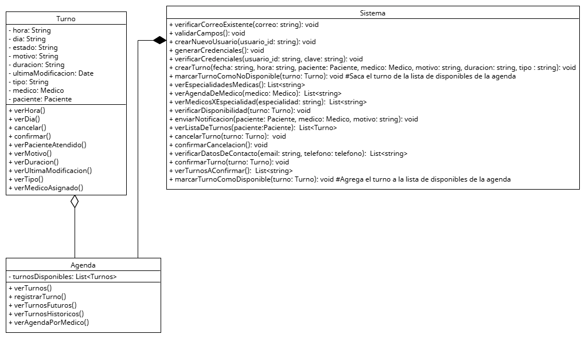

 # Abstracción

La abstracción en programación orientada a objetos permite modelar entidades complejas del mundo real, identificando y conservando solo aquellos atributos y comportamientos esenciales para cumplir con un propósito dentro del sistema.
Su objetivo es ocultar la complejidad innecesaria para que el código sea más claro, enfocado y fácil de mantener.

## Relación con principios SOLID y patrones de diseño

**SRP**: Una buena abstracción permite que una clase represente una única idea o función (una sola razón para cambiar).

**ISP**: Usar interfaces específicas por tipo de funcionalidad mejora la abstracción y evita mezclas innecesarias.

**DIP**: Abstraer dependencias mediante interfaces evita acoplamientos rígidos.

## Ejemplo del proyecto


## Ejemplo de Código

```
public class Turno {
    private LocalDateTime fechaHora;
    private Paciente paciente;
    private Medico medico;
    private String estado;
    private int duracion;
    private LocalDateTime ultimaModificacion;
    private String tipo;
    
    public Turno(LocalDateTime fechaHora, Paciente paciente, Medico medico, int duracion, String tipo) {
        this.fechaHora = fechaHora;
        this.paciente = paciente;
        this.medico = medico;
        this.duracion = duracion;
        this.tipo = tipo;
    }

    public void cancelar() {
        // lógica para cancelar el turno
    }

    public void reprogramar(LocalDateTime nuevaFecha) {
        // lógica para reprogramar
    }
}
```

# Aplicación del fundamento

La clase Turno es un ejemplo claro de abstracción efectiva, ya que:
* Define únicamente los atributos fundamentales de un turno: fecha y hora, el paciente asignado y el médico que lo atenderá.
* Expone comportamientos propios del turno como cancelar() y reprogramar(), que son acciones inherentes a este objeto en el dominio.
* Oculta detalles no relevantes en este nivel, como la validación de horarios, el envío de notificaciones, o la lógica de almacenamiento en base de datos (que deben delegarse a otras clases especializadas).

Gracias a esta abstracción el diseño permanece enfocado en el dominio sin contaminarse con otras responsabilidades técnicas. Las clases que usen Turno pueden hacerlo sin preocuparse por cómo se implementa internamente.

