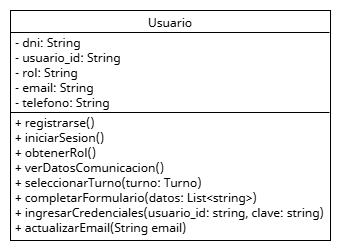

 # Encapsulamiento

El encapsulamiento es el principio por el cual los detalles internos de un objeto (sus atributos y métodos privados) se ocultan al mundo exterior, permitiendo que el acceso y modificación de su estado se realicen únicamente a través de una interfaz pública controlada. Esto ayuda a proteger la integridad de los datos y a mantener un bajo acoplamiento entre las clases del sistema.

## Relación con principios SOLID y patrones de diseño

**SRP**: Encapsular ayuda a que la clase se mantenga enfocada, sin que otros accedan directamente a sus datos o lógica interna.

**OCP**: Encapsular permite extender comportamientos (usando herencia o composición) sin alterar el código original.

**DIP**: Encapsulamos detalles de implementación tras interfaces, y desacoplamos la lógica central del sistema.

## Ejemplo del proyecto


## Ejemplo de Código

```
public class Usuario {
    private String usuario_id;
    private String dni;
    private String email;
    private String rol;
    private String telefono;

    public Usuario(String usuario_id, String dni, String email, String rol, String telefono) {
        this.nombre = nombre;
        this.dni = dni;
        this.rol = rol;
        this.telefono = telefono;
        this.email = email;
    }

    public String getDatosComunicacion() {
        if (email != null){
            return email;
        }
        if (telefono != null){
            return telefono;
        }
    }

    public void actualizarEmail(String nuevoEmail) {
        if (esRolValido(nuevoEmail)) {
            this.email = nuevoEmail;
        }
    }

    private boolean esEmailValido(String email) {
        return email.contains("@");
    }
}
```

# Aplicación del fundamento

Esta clase demuestra un uso correcto del encapsulamiento:
* Los atributos nombre, dni y email están declarados como private, lo que impide el acceso directo desde fuera de la clase.
* Se proporciona un método getDatosComunicacion() para consultar lod datos de comunicacion sin exponer a los atributos directamente y devolviendo el dato preferente por el usuario.
* La modificación del email debe hacerse a través de actualizarEmail(), que controla la lógica de validación internamente.
* El método esEmailValido() está marcado como private porque no debe ser accesible externamente, lo cual mantiene la lógica encapsulada y segura.

Esto permite que la clase mantenga su estado válido y consistente, y que las reglas internas estén bien protegidas.