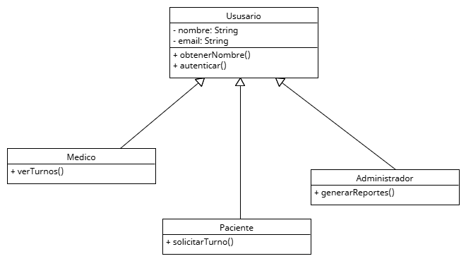

 # Herencia

La herencia permite que una clase (llamada subclase) herede atributos y comportamientos de otra clase (llamada superclase), evitando duplicación de código y promoviendo la reutilización y el modelado jerárquico. Además, permite que las subclases especialicen o modifiquen el comportamiento heredado según sus propias necesidades, manteniendo una estructura coherente entre objetos relacionados.

## Relación con principios SOLID y patrones de diseño

**LSP**: Las subclases deben ser compatibles con las clases base, lo que implica heredar correctamente sin romper comportamiento.

**OCP**: La herencia permite extender funcionalidad sin modificar el código base.

**SRP**: Si una subclase hereda demasiadas responsabilidades, viola SRP; por eso es importante que la herencia respete roles bien definidos.

## Ejemplo del proyecto


## Ejemplo de Código

```
public class Usuario {
    protected String nombre;
    protected String email;

    public String getEmail() {
        return email;
    }
}

public class Paciente extends Usuario {
    private List<Turnos> historialTurnos;

    public String getHistorialTurnos() {
        return historialTurnos;
    }
}

public class Medico extends Usuario {
    private String especialidad;

    public String getEspecialidad() {
        return especialidad;
    }
}
```

# Aplicación del fundamento

Este diseño aplica correctamente el principio de herencia:
* Atributos comunes como nombre y email, y comportamientos como getEmail() están definidos en la superclase Usuario.
* Las subclases Paciente y Medico heredan esos atributos y métodos, lo que evita duplicación y facilita el mantenimiento.
* Luego, cada subclase agrega su propia información específica: historialTurnos para Paciente, y especialidad para Medico.
* Esto permite tratar de forma general a cualquier objeto que sea instancia de Usuario, independientemente de si es un Paciente o un Medico.

La herencia, bien aplicada, promueve la reutilización y la claridad estructural del modelo de dominio. En este caso, el diseño de una jerarquía centrada en la clase Usuario permite gestionar múltiples tipos de usuarios de forma coherente, facilita la extensión futura del sistema y cumple con los principios SOLID para lograr un diseño escalable y mantenible.