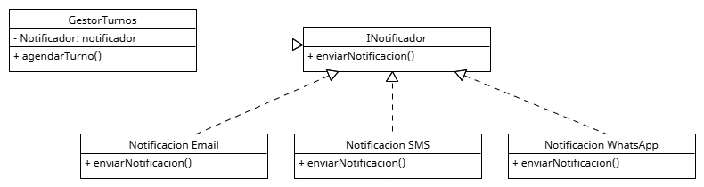

 # Polimorfismo

El polimorfismo permite que un mismo mensaje pueda ser interpretado y ejecutado de distintas maneras según el objeto concreto que lo recibe. Esto se logra mediante interfaces o clases base, lo que permite intercambiar objetos en tiempo de ejecución sin modificar el código cliente.

## Relación con principios SOLID y patrones de diseño

**DIP**: El polimorfismo permite que el código dependa de interfaces (abstracciones) y no de implementaciones concretas.

**ISP**: Al tener interfaces pequeñas y específicas, múltiples clases pueden implementarlas con distintos comportamientos polimórficos.

**OCP**: Permite extender funcionalidad agregando nuevas clases sin cambiar el código cliente.

## Ejemplo del proyecto


## Ejemplo de Código

```
public interface Notificador {
    void notificar(String mensaje, String destino);
}

public class EmailNotificador implements Notificador {
    public void notificar(String mensaje, String destino) {
        // lógica para enviar correo
    }
}

public class SMSNotificador implements Notificador {
    public void notificar(String mensaje, String destino) {
        // lógica para enviar SMS
    }
}
```

# Aplicación del fundamento

Este ejemplo refleja el uso de polimorfismo de forma clara y eficiente:
* GestorDeTurnos trabaja con el tipo abstraído Notificador, sin preocuparse por la implementación concreta.
* Al momento de ejecutar el método notificar(), el sistema determina automáticamente si se está usando un EmailNotificador o un SMSNotificador.
* Las clases que implementan Notificador pueden tener comportamientos totalmente distintos, pero mientras cumplan con la firma del método, son intercambiables.
* Esto habilita decisiones en tiempo de ejecución, como:
    * Elegir el canal de notificación según las preferencias del paciente.
    * Sustituir el tipo de notificador sin modificar el GestorDeTurnos.

El polimorfismo permite que el sistema se mantenga flexible y extensible, reduciendo el acoplamiento entre componentes. En el proyecto, su aplicación se ve reflejada en la lógica de notificaciones, donde múltiples estrategias se utilizan sin alterar el flujo principal. Este enfoque promueve el cumplimiento de principios SOLID y facilita el crecimiento futuro del sistema sin reescrituras innecesarias.