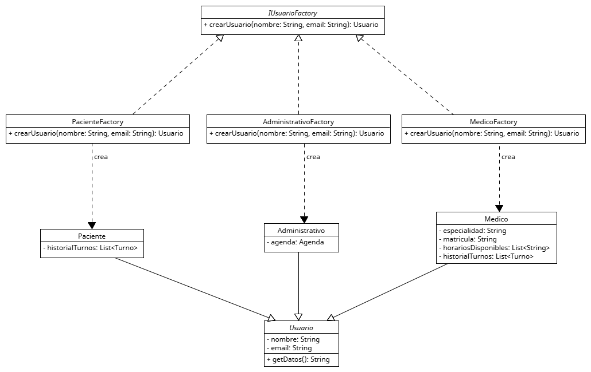

# Anexo - Aplicación de Patrón de Diseño creacional - Factory Method

Los patrones de diseño creacionales son soluciones reutilizables a problemas comunes relacionados con la creación de objetos en software. Su objetivo es abstraer el proceso de instanciación, de modo que el código quede más flexible, desacoplado y fácil de mantener. En lugar de usar directamente new para crear objetos, estos patrones permiten delegar la lógica de creación a clases especializadas, facilitando:
* Reutilización de código,
* Separación de responsabilidades,
* Capacidad de ampliar el sistema sin modificarlo.

Los patrones creacionales, están estrechamente ligados a los principios SOLID, en especial:

S - Single Responsibility Principle (SRP):
Cada clase tiene una única responsabilidad: crear un tipo específico de objeto.

O - Open/Closed Principle (OCP):
Podemos agregar nuevas fábricas sin modificar las existentes, haciendo el sistema extensible.

D - Dependency Inversion Principle (DIP):
El código cliente depende de interfaces abstractas en lugar de clases concretas (Paciente, Profesional), promoviendo un bajo acoplamiento.

La creación de objetos Usuario en el sistema de turnos requiere manejar distintos atributos y comportamientos según el tipo. Si se hace manualmente en todas partes, el código se vuelve repetitivo, difícil de escalar y propenso a errores. El Factory Method permite definir una interfaz común para crear objetos (UsuarioFactory), y delega en subclases (PacienteFactory, ProfesionalFactory, etc.) la responsabilidad de decidir qué tipo concreto de objeto crear. Esto hace que el sistema sea modular, fácil de extender y mantener.

## Motivacion

En el sistema de gestión de turnos médicos, el manejo de diferentes tipos de usuarios es fundamental. Cada tipo de usuario tiene atributos y comportamientos particulares:

**Paciente**
* Datos personales (nombre, documento, contacto).
* Historial de turnos y consultas.
* Preferencias de notificación.
* Capacidad de modificar o cancelar turnos.

**Medico**
* Datos personales y profesionales (especialidad, horario de atención).
* Agenda médica para turnos.

**Administrativo**
* Control de usuarios y turnos.
* Validaciones y autorizaciones.

Problemas que esto genera:
* El código usuario necesita conocer detalles concretos de cada clase (Paciente, Medico, Administrativo).
* La lógica de creación queda dispersa y duplicada.
* Si el proceso de creación cambia (por ejemplo, un nuevo campo obligatorio o una validación), hay que modificar múltiples lugares.
* Dificulta aplicar principios SOLID como la inversión de dependencias y la responsabilidad única.

El patrón Factory Method propone delegar la creación de objetos a clases especializadas llamadas fábricas. En lugar de que el código cliente instancie directamente, solicita un objeto a una fábrica que conoce cómo crearlo.

* **Centraliza la lógica de creación**:
Cada fábrica conoce cómo crear su tipo de usuario, incluyendo validaciones, asignaciones iniciales o configuración de dependencias (por ejemplo, asociar una agenda al profesional de salud).

* **Desacopla al cliente de las clases concretas**:
El cliente solo interactúa con la interfaz abstracta UsuarioFactory, lo que facilita cambiar o extender tipos de usuario sin afectar clientes.

* **Facilita la extensión**:
Para agregar un nuevo tipo, solo se crea una nueva fábrica que implementa la creación, sin modificar código existente.

* **Cumple con SOLID**:
Se asigna a cada clase una única responsabilidad (crear un tipo específico), se evita modificar código existente y se depende de abstracciones.

**Antes del patrón**
* Usuario (interface o clase abstracta): Base para pacientes, profesionales, administrativos.
* Paciente, Medicos, Administrativo: Implementan/Extienden Usuario.

**Después del patrón**
Clase | Tipo | Descripción
--|--|--
UsuarioFactory | Abstracta | Define la interfaz para crear objetos Usuario.
PacienteFactory | Concreta | Implementa crearUsuario(), crea y configura un Paciente.
ProfesionalFactory | Concreta | Implementa crearUsuario(), crea y configura un ProfesionalSalud.
AdministrativoFactory | Concreta | Implementa crearUsuario(), crea y configura un Administrativo.

**Flujo de creación con Factory Method**
1. El cliente solicita una fábrica según el tipo de usuario deseado.
2. Invoca crearUsuario(...) en la fábrica seleccionada.
3. La fábrica devuelve una instancia completamente configurada del usuario.
4. El cliente usa la instancia sin conocer su clase concreta ni la lógica de creación interna.

**Beneficios técnicos**
* **Menor acoplamiento**: Código cliente y clases de usuario están desacoplados.
* **Modularidad y mantenibilidad**: La creación está encapsulada en fábricas que se pueden modificar o extender fácilmente.
* **Escalabilidad**: Facilita agregar nuevos tipos sin impacto en el resto del sistema.

## Estructura de Clases

