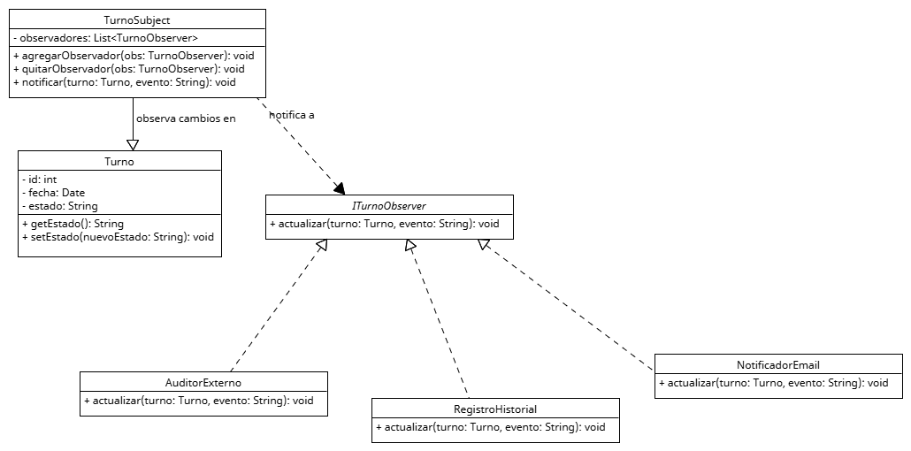

## Anexo - Aplicación de Patrón de Diseño de comportamiento - Observer

Los patrones de diseño de comportamiento se centran en cómo los objetos se comunican e interactúan entre sí. Su objetivo principal es organizar el flujo de control y la distribución de responsabilidades entre clases, permitiendo que los sistemas sean más flexibles, escalables y fáciles de mantener. Estos patrones son ideales cuando:
* Hay muchos objetos que necesitan colaborar.
* Queremos desacoplar quién emite un evento de quién lo maneja.
* Se necesita variar el comportamiento del sistema sin modificar su estructura interna.

Los patrones de comportamiento se alinean fuertemente con varios principios SOLID, entre ellos:
S - Single Responsibility Principle	Cada clase tiene una responsabilidad específica: emitir eventos o reaccionar a ellos.
O - Open/Closed Principle	Podemos agregar nuevos observadores sin modificar el código del sujeto observado.
L - Liskov Substitution Principle	Todos los observadores implementan una interfaz común (TurnoObserver), garantizando su intercambiabilidad.
D - Dependency Inversion Principle	El sujeto (TurnoSubject) depende de una abstracción (TurnoObserver) y no de clases concretas como NotificadorEmail o AuditorExterno.

El patrón Observer propone que el objeto que detecta un evento (como un cambio de estado de turno) no se encargue de sus consecuencias, sino que notifique a una lista de observadores, los cuales pueden reaccionar de manera independiente. Cada observador (por ejemplo, NotificadorEmail, RegistroHistorial, AuditorExterno) implementa una misma interfaz (TurnoObserver) y puede añadirse dinámicamente. De esta forma:
* El sujeto no necesita saber quién lo observa ni qué hacen con el evento.
* Se pueden agregar nuevos observadores sin modificar el código existente.
* El sistema se vuelve modular, extensible y desacoplado.

## Motivacion

En el sistema de turnos médicos, cuando se crea, modifica o cancela un turno, múltiples acciones deben ejecutarse de forma automática:
* Notificar por correo al paciente.
* Registrar el cambio en el historial del usuario.
* Informar al sistema de auditoría o integración externa.
Sin un patrón adecuado, el módulo que gestiona los turnos (GestorTurno o similar) tendría que encargarse directamente de todas estas tareas, lo que produce:
* Código rígido y difícil de mantener.
* Fuerte acoplamiento entre módulos.
* Dificultad para escalar o agregar nuevas reacciones ante cambios.

Problema sin usar Observer:
Antes de aplicar el patrón, todas esas acciones estaban acopladas dentro de la clase que gestiona los turnos. Esto implica que la clase debía conocer, instanciar y coordinar múltiples servicios.

El patrón Observer propone una solución en la que la clase que administra el turno notifica automáticamente a los observadores registrados cuando ocurre un evento. Cada observador se registra como suscriptor de los eventos del turno y reacciona de manera independiente.
Así, TurnoSubject no necesita saber qué observadores tiene ni qué hacen, solo dispara un evento con los datos del turno. Este enfoque reduce el acoplamiento y aumenta la extensibilidad del sistema.

**Antes del patrón**
* GestorTurno: Administra creación, modificación y cancelación de turnos. Incluía toda la lógica de notificación, historial y auditoría.
* Turno: Representa los datos del turno: fecha, paciente, estado, etc.

**Después del patrón**
Clase | Rol | Función
--|--|--
TurnoSubject | Sujeto observado | Mantiene una lista de observadores y los notifica cuando ocurre un cambio en un turno.
TurnoObserver | Interfaz | Define el método actualizar(turno, evento) que todos los observadores deben implementar.
NotificadorEmail | Observador | Envía un correo electrónico al paciente cuando recibe la notificación.
RegistroHistorial | Observador | Registra el evento en el historial del paciente.
AuditorExterno | Observador | Reporta el cambio a un sistema externo de auditoría.

**Flujo con Observer** aplicado:**
1. TurnoSubject representa el turno a observar.
2. Los observadores (NotificadorEmail, RegistroHistorial, AuditorExterno) se registran en el TurnoSubject.
3. Cuando el turno cambia de estado, TurnoSubject.notificar() se llama.
4. Cada observador recibe el evento a través de actualizar(turno, evento) y actúa según su propósito.

**Beneficios técnicos**
* **Bajo acoplamiento**: El sujeto (TurnoSubject) no conoce a los observadores concretos.
* **Extensibilidad**: Se pueden agregar nuevas reacciones sin modificar clases existentes.
* **Responsabilidades bien distribuidas**: Cada clase tiene una única responsabilidad (SRP).
* **Mayor reutilización y testeo**: Cada observador puede testearse o reutilizarse en otros contextos.

## Estructura de Clases

