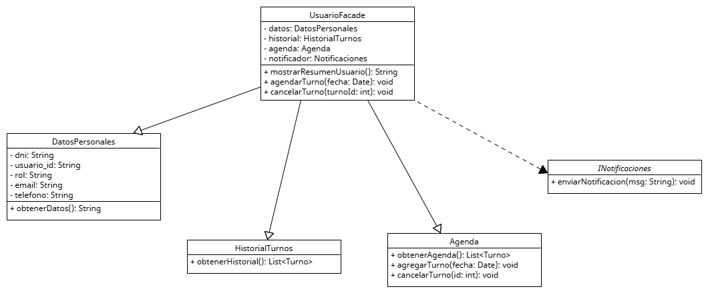

# Anexo - Aplicación de Patrón de Diseño estructural - Facade

Los patrones de diseño estructurales se enfocan en la organización y composición de clases y objetos para formar estructuras más grandes, flexibles y reutilizables. Su objetivo es simplificar las relaciones entre clases y mejorar cómo colaboran entre sí, especialmente cuando los sistemas crecen en complejidad. Estos patrones permiten:
* Reducir el acoplamiento entre componentes.
* Ocultar detalles internos de implementación.
* Reutilizar estructuras sin modificar código existente.

Los patrones estructurales ayudan a aplicar varios principios SOLID, especialmente:

S - Single Responsibility Principle (SRP):
Al introducir una clase que actúa como intermediaria (por ejemplo, una fachada), cada clase mantiene su responsabilidad específica.

O - Open/Closed Principle (OCP):
Las clases estructuradas mediante patrones como Facade pueden ser extendidas sin modificar su lógica interna ni la de sus dependencias.

D - Dependency Inversion Principle (DIP):
Las clases cliente dependen de una interfaz simplificada (la fachada), no de los detalles internos de múltiples módulos.

En el sistema de turnos médicos, los datos de un usuario están dispersos en múltiples clases (DatosPersonales, Agenda, HistorialTurnos, Notificaciones). Cuando otras partes del sistema necesitan interactuar con estos datos, deben acceder a varias clases diferentes, generando código duplicado, alto acoplamiento y dificultad para mantener y escalar el sistema

El patrón Facade introduce una clase (UsuarioFacade) que actúa como puerta de entrada única a toda la información y funcionalidad relacionada con un usuario. El resto del sistema solo interactúa con la fachada, sin necesidad de conocer o coordinar las clases internas. Esto mejora la organización del sistema, reduce el acoplamiento, y facilita futuras modificaciones sin afectar al cliente.

## Motivacion

En el sistema de gestión de turnos médicos, un usuario está vinculado a varios módulos o componentes que gestionan información independiente pero relacionada:

**Paciente**
* DatosPersonales (nombre, DNI, correo electrónico)
* HistorialTurnos
* Agenda administra los próximos turnos o disponibilidad.
* Notificaciones se encarga de enviar mensajes (email/SMS) al paciente.

Problemas que esto genera:
Cuando otras partes del sistema (por ejemplo, un controlador, una vista o un servicio) necesitan mostrar un resumen del paciente o realizar acciones sobre él, deben interactuar con múltiples objetos directamente.

* Alto acoplamiento, el código cliente depende directamente de múltiples clases internas.
* Dificultad de mantenimiento, si cambia alguna clase (por ejemplo, la estructura de Agenda), hay que modificar todos los lugares que la usaban.
* Poca cohesión, la lógica para manejar al usuario está dispersa, y cada clase cliente debe conocer los detalles internos.
* Repetición de lógica, si hay que hacer una operación típica, el mismo conjunto de llamadas se repite en distintos lugares.

El patrón Facade propone introducir una nueva clase UsuarioFacade que encapsule la interacción con los diferentes subsistemas relacionados al usuario. La fachada se convierte en un único punto de entrada para acceder a los datos y acciones del usuario, delegando internamente a los objetos correspondientes.

* **Reducción del acoplamiento**
El cliente solo conoce a la fachada (UsuarioFacade), no a las clases internas. Esto significa que las clases internas pueden cambiar, evolucionar o incluso ser reemplazadas sin impactar en el resto del sistema.

* **Encapsulamiento de la complejidad**
UsuarioFacade esconde la complejidad de cómo y en qué orden se llaman los métodos internos. El cliente solo necesita invocar un método de alto nivel y la fachada se encarga del resto. Termina reduciendo errores, mejorando la legibilidad y obteniendo un código más intuitivo.

* **Reutilización de lógica común**
La lógica común se implementa una sola vez en la fachada. Cualquier parte del sistema puede reutilizarla sin duplicación. Se logra evitar código repetido, reducir inconsistencias y mejorar la mantenibilidad.

* **Mayor seguridad y control de acceso**
Como el cliente ya no accede directamente a las clases internas, se puede controlar qué datos y operaciones están disponibles públicamente desde la fachada. Se pueden aplicar validaciones, reglas de negocio o filtros en un solo lugar. Se crea un mejor control del sistema, más alineado con buenas prácticas de encapsulamiento y seguridad.

* **Facilidad para pruebas unitarias y mocks**
El uso de la fachada permite mockear o testear funcionalidad de usuario sin necesidad de preparar e instanciar todos los objetos internos individualmente. Basta con probar los métodos de alto nivel de la fachada. Las pruebas son más rápidas, simples y enfocadas en comportamientos globales.

* **Base sólida para futuras ampliaciones**
Si más adelante necesitás incluir nuevos módulos, se puede ampliar UsuarioFacade sin modificar el código cliente.

**Antes del patrón**
* DatosPersonales: Contiene información básica del usuario (nombre, DNI, email).
* HistorialTurnos: Devuelve los turnos anteriores del usuario.
* Agenda: Contiene los turnos programados o disponibilidad.
* Notificaciones: Permite enviar mensajes al usuario.

Cada una de estas clases trabaja de forma independiente, pero todas son necesarias para operaciones comunes.

**Después del patrón**
Clase | Tipo | Función
--|--|--
UsuarioFacade | Facade | Interfaz simplificada que permite al sistema acceder a toda la funcionalidad relacionada con un usuario sin conocer los detalles internos.

**Flujo de agendamiento de turno**
1. Cliente solicita a UsuarioFacade que agende un turno en determinada fecha.
2. UsuarioFacade recibe la solicitud.
3. Internamente, la fachada invoca a Agenda.agregarTurno(fecha).
4. Luego, invoca a Notificaciones.enviarNotificacion(...) para informar al paciente.
5. La fachada devuelve al cliente una confirmación.

El patrón estructural Facade es especialmente útil cuando varias clases deben ser utilizadas juntas de manera frecuente. En este sistema:
* Encapsula la complejidad de acceder a los módulos del usuario (datos, historial, agenda, notificaciones).
* Reduce el acoplamiento, mejora la legibilidad y promueve una arquitectura limpia y escalable.
* Prepara el sistema para integrar fácilmente nuevos módulos sin afectar a las clases consumidoras.

## Estructura de Clases

