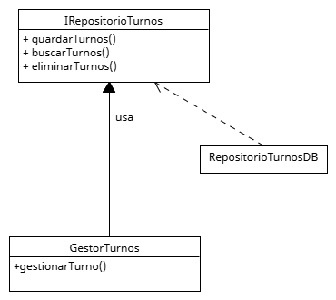

# Principio de Inversión de Dependencias (DIP)

## Propósito y Tipo del Principio SOLID

El Principio de Inversión de Dependencias (Dependency Inversion Principle) establece que _los módulos de alto nivel no deben depender de módulos de bajo nivel; ambos deben depender de abstracciones_.

Además, _las abstracciones no deben depender de los detalles; los detalles deben depender de las abstracciones_.

## Motivación

En el sistema de turnos médicos, la clase `GestorDeTurnos` originalmente dependía directamente de la implementación concreta `RepositorioTurnosDB` para acceder a los datos.

Esto generaba un fuerte acoplamiento que dificultaba:
* Reemplazar el repositorio por otro (por ejemplo, uno en memoria para testing).
* Aplicar pruebas unitarias sin tener acceso a una base de datos real.
* Cambiar la forma de persistencia sin modificar el código de `GestorDeTurnos`.

## Estructura de Clases

### Solución aplicada

Se creó una interfaz `RepositorioTurnos`, que define los métodos necesarios para interactuar con los turnos (guardar, buscar, eliminar, etc.).

* `GestorDeTurnos` depende ahora de `RepositorioTurnos` y no de una implementación concreta.
* Implementaciones como `RepositorioTurnosDB` implementan esta interfaz.

## Diagrama UML

## Justificación técnica

* `GestorDeTurnos` ahora depende de una abstracción (`RepositorioTurnos`) y no de una clase concreta.
* Se pueden inyectar implementaciones distintas según el contexto (producción o pruebas).
* Mejora la escalabilidad y la capacidad de mantenimiento del sistema.
* Fomenta una arquitectura desacoplada y fácil de testear.

## Conclusión

Con el Principio de Inversión de Dependencias, se logra un sistema más flexible y preparado para el cambio, donde los componentes de alto nivel no se ven afectados por modificaciones en los detalles de implementación.
