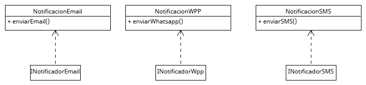

# Principio de Segregación de Interfaces (ISP)

## Propósito y Tipo del Principio SOLID

El Principio de Segregación de Interfaces (Interface Segregation Principle) establece que _ninguna clase debe verse obligada a depender de métodos que no utiliza_.
Este principio promueve la creación de interfaces específicas para cada tipo de funcionalidad, en lugar de tener una única interfaz genérica muy grande que todas las clases deben implementar.

## Motivación

Por ejemplo, una clase NotificadorEmail que solo envía correos electrónicos se vería forzada a implementar también los métodos para SMS y WhatsApp, aunque no los utilice, llenando el código de métodos vacíos o lanzando excepciones.

## Estructura de Clases

### Solución aplicada

Dividimos la gran interfaz Notificador en interfaces pequeñas y específicas según el canal de comunicación:

* NotificadorEmail
* NotificadorSMS
* NotificadorWhatsApp

Cada clase concreta implementa únicamente la interfaz que necesita, cumpliendo con ISP y evitando código innecesario.

## Diagrama UML

## Justificación técnica

* Se evita que las clases implementen métodos innecesarios.
* Se mejora la cohesión de cada interfaz.
* Se reduce el acoplamiento y se facilita el mantenimiento.
* Permite agregar funcionalidades específicas sin romper a los demás usuarios.

## Conclusión

Gracias al Principio de Segregación de Interfaces, el diseño del sistema se vuelve más claro y modular, adaptado a los diferentes roles de usuario sin imponer implementaciones innecesarias.
