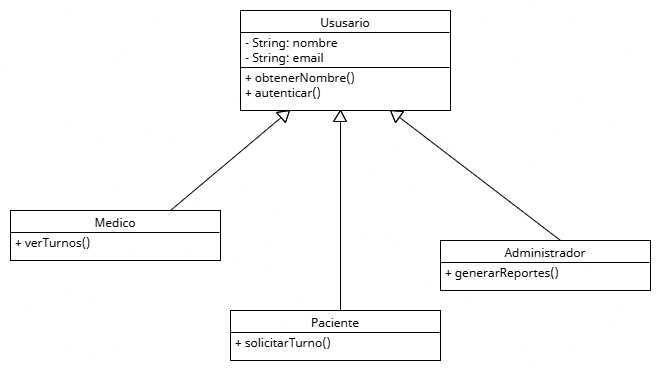

# Principio de Sustitución de Liskov (LSP)

## Propósito y Tipo del Principio SOLID

El Principio de Sustitución de Liskov (Liskov Substitution Principle) establece que _las clases derivadas deben poder ser utilizadas en lugar de sus clases base sin alterar el comportamiento correcto del programa_.

En otras palabras, si `ClaseHija` extiende a `ClasePadre`, cualquier instancia de `ClaseHija` debe poder reemplazar a `ClasePadre` sin romper la lógica del sistema. Este principio garantiza la correcta utilización del polimorfismo.

## Motivación

En el sistema de turnos médicos, existen diferentes tipos de usuarios: Pacientes, Médicos y Administradores. Todos comparten algunas características básicas (nombre, email, autenticación), pero cada uno tiene funcionalidades específicas.

Supongamos que tenemos una clase base `Usuario`, y derivamos de ella las clases `Paciente`, `Medico` y `Administrador`. Si `Turno` utiliza objetos de tipo `Usuario`, esperamos que cualquier subclase (`Paciente`, `Medico`) pueda ser usada sin romper la lógica del sistema.

Si, por ejemplo, `Paciente` no implementara correctamente un método común como `obtenerNombre()`, o lanzara errores al acceder a métodos de la clase base, se violaría el principio LSP.

## Estructura de Clases

### Solución aplicada

Creamos una clase base `Usuario` con métodos comunes, y subclases que respetan la interfaz y comportamiento esperados:

* `Paciente`: puede solicitar turnos.
* `Medico`: puede ver y gestionar turnos asignados.
* `Administrador`: puede ver reportes y modificar configuraciones.

Esto permite trabajar con listas de `Usuario` sin preocuparnos por el tipo específico, ya que todos cumplen el mismo contrato.

## Diagrama UML

## Justificación técnica

* `Paciente`, `Medico` y `Administrador` pueden ser tratados como `Usuario` por cualquier componente del sistema.
* Ninguna subclase rompe el comportamiento esperado definido en la clase base.
* Se facilita el uso de polimorfismo sin riesgo de errores.

## Conclusión

Gracias al Principio de Sustitución de Liskov, el sistema de turnos médicos puede trabajar de forma segura con jerarquías de clases como `Usuario`, sabiendo que todas las subclases se comportarán correctamente. Esto permite extender funcionalidades específicas según el tipo de usuario sin comprometer la estructura general del sistema.
