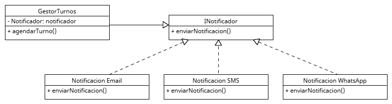

# Principio Abierto/Cerrado (OCP)

## Propósito y Tipo del Principio SOLID

El Principio Abierto/Cerrado (Open/Closed Principle) propone que _las clases deben estar abiertas para su extensión, pero cerradas para su modificación_. Esto significa que debemos poder añadir nuevas funcionalidades sin tener que alterar el código ya existente.

Este principio se apoya en el uso de herencia, interfaces y polimorfismo, permitiendo la evolución del sistema sin romper el código funcional.

## Motivación

En un sistema de turnos médicos, pueden surgir nuevas necesidades sin previo aviso:

* Incorporar nuevos canales de notificación: WhatsApp, SMS, Telegram.
* Agregar validaciones adicionales para ciertos turnos (por ejemplo, médicos con horarios especiales).
* Armar turnos de duraciones exepcionales.

Modificar directamente las clases existentes para adaptarse a cada caso rompe el principio OCP y puede introducir errores o efectos colaterales. En cambio, podemos extender comportamientos mediante nuevas clases que respeten interfaces comunes.

## Estructura de Clases

### Solución aplicada

Implementamos el principio OCP con el uso de una interfaz `Notificador` que es implementada por distintas clases:

- `NotificadorEmail`
- `NotificadorSMS`
- `NotificadorWhatsApp`

Luego, la clase `GestorTurnos` depende de la abstracción `Notificador`, no de una implementación concreta. Podemos seguir agregando nuevas notificaciones sin modificar su código.

## Diagrama UML

## Justificación técnica

* Podemos agregar nuevos tipos de notificaciones sin modificar `Notificador`.
* El sistema es extensible, adaptable a nuevas necesidades o servicios externos.
* Se evita el efecto dominó de errores por modificar una clase central.
* El diseño es más robusto ante el cambio y cumple con buenas prácticas.

## Conclusión

El principio Abierto/Cerrado nos permitió diseñar un sistema flexible y preparado para crecer, separando la lógica de notificación del gestor de turnos. Este patrón promueve la reutilización y evita modificar código en producción para incorporar nuevas funcionalidades.
