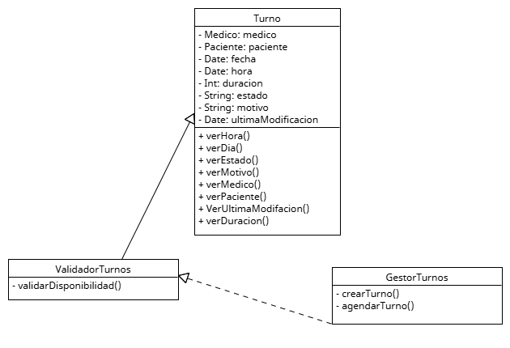

# Principio de Responsabilidad Única (SRP)

## Propósito y Tipo del Principio SOLID

El Principio de Responsabilidad Única (SRP - Single Responsibility Principle) establece que _una clase debe tener una única razón para cambiar_, es decir, debe encargarse de una única responsabilidad o funcionalidad dentro del sistema. Esto reduce el acoplamiento, mejora la organización del código y facilita el mantenimiento.

## Motivación
En versiones iniciales del diseño del sistema de turnos médicos, algunas clases como `Turno` acumulaban múltiples responsabilidades:

* Contenían la lógica de datos del turno.
* Validaban disponibilidad.
* Coordinaban persistencia (guardar, actualizar).
* Enviaban notificaciones a pacientes y médicos.

Esto generaba acoplamiento innecesario y dificultaba:

* La modificación independiente de cada funcionalidad.
* La reutilización del código.
* Las pruebas unitarias.

En la vida real. un recepcionista que se encarga de agendar turnos, avisar a los médicos, enviar recordatorios por WhatsApp y al mismo tiempo gestionar el stock de insumos está sobrecargado. Si esa persona falta o comete un error, todo el sistema se ve afectado. Lo mismo sucede con una clase que asume demasiadas funciones.

## Estructura de Clases

### Solución aplicada

Aplico SRP dividiendo responsabilidades en clases especializadas:
En el diseño actualizado, ValidadorTurnos actúa como un servicio independiente con responsabilidad exclusiva de validar reglas de negocio (como disponibilidad de horarios), mientras que GestorTurnos funciona como un coordinador que orquesta el flujo de creación del turno, apoyándose en otras clases. No existe herencia entre ellas, sino relaciones de uso (dependencia).

* `Turno`: almacena los datos del turno (fecha, hora, paciente, médico).
* `ValidadorTurnos`: valida disponibilidad de horarios para un nuevo turno.
* `GestorTurnos`:  clase tipo "orquestador" o "servicio de aplicación" que coordina la creación del turno.

De esta forma, cada clase tiene una sola razón para cambiar.

## Diagrama UML

El siguiente diagrama representa cómo se distribuyen las responsabilidades siguiendo el SRP:

## Justificación técnica

* Las responsabilidades quedan bien delimitadas.
* Cada clase puede evolucionar de forma independiente.
* Permite realizar pruebas unitarias más precisas.
* Mejora el orden lógico del sistema y su documentación.
* Facilita la legibilidad y mantenimiento por parte de otros desarrolladores.

## Conclusión

Aplicar el Principio de Responsabilidad Única en el sistema de turnos médicos permitió dividir el sistema en componentes simples y especializados. Esto hizo posible tener un diseño más limpio, flexible y preparado para cambios futuros sin afectar funcionalidades ya existentes.
